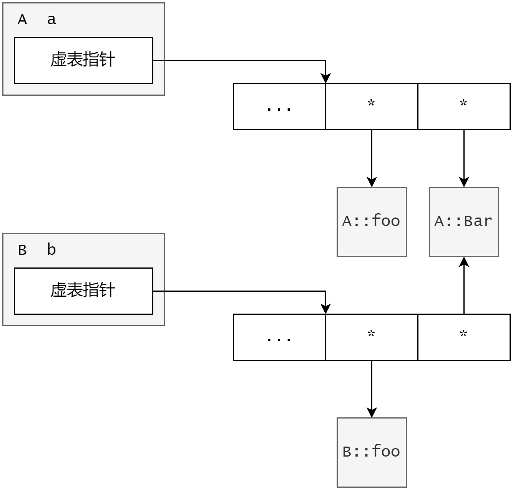

# Day 10

**虚函数** <p>
***没有虚函数的程序——非虚的世界***
- 对象的自洽性
    - 对同样的函数调用, 各个类对象都能作出恰当的响应
- 通过基类类型指针调用普通成员函数只能调用基类的成员函数
    - 即使这个基类类型的指针指向子类对象, 调用的地方也为基类的成员函数
    - 一旦调用子类所持有的成员函数, 将引发**编译错误**
    - 编译器仅**根据指针的类型**调用哪个类的普通成员函数

***虚函数与覆盖*** <p>
- 形如以下结构的**成员函数** , 称之为**虚函数或方法**
    ```
    class 类名 {
        virtual 返回类型 函数名(形参表) { ... }
    };
    ```
- 覆盖
    - 可以先自行了解**函数原型、函数签名**的区别 **(网址: https://blog.csdn.net/qq_39827640/article/details/129431021)**
    - 如果子类的成员函数和基类的虚函数**具有相同的函数签名(可以简单的理解为函数名和参数列表相同)**, 那么该成员函数也就是虚函数, 无论其是否带有 `virtual` 关键字, 且与基类的虚函数构成**覆盖关系** 

***虚函数的程序——虚函数的世界***
- 对象的自洽性
    - 对同样的函数调用, 各个类对象都能作出恰当的响应
- 通过基类类型指针调用虚函数
    - 如果基类型指针指向基类对象, 调用基类的**原始版本**虚函数
    - 如果基类型指针指向子类对象, 调用子类的**覆盖版本**虚函数

**虚函数应用——多态** <p>
***多态的概念***
- 如果子类提供了对基类虚函数的有效覆盖, 那么通过一个基类型指针(指向子类对象), 或者基类型引用(引用子类对象), 调用该虚函数, 实际调用的将是子类中的覆盖版本, 而非基类中的原始版本, 这种现象称为**多态**
- 多态的重要意义在于, 一般情况下, 调用哪个类的成员函数是由指针或引用**本身的类型**决定的, 而当多态发生时, 调用哪个类的成员函数是由指针或引用的**实际目标对象的类型**决定的

***多态的条件***
- 需要在基类中定义虚函数, 子类提供覆盖版本 **(为什么要定义一个基类对象指向子类指针: https://blog.csdn.net/qq_33551749/article/details/108402617)**
- 必须借助及类型指针(指向子类对象), 或者基类型引用(引用子类对象), 调用该虚函数
- 具备上面两个要件, 多态才能表现出来

***多态的结果*** <p>
最终调用为子类覆盖版本的虚函数, 而非原始版本虚函数

***this指针和多态*** <p>
调用虚函数的指针也可以是基类中的 **this指针** , **同样能满足多态的条件, 但在构造和析构函数中除外**, 因为构造函数和析构函数本质还是由基类调用的——**以构造函数为例: 在子类中定义基类对象, 基类对象调用基类的构造函数**

**多态的本质——虚函数表** <p>
***虚函数表***
```
class A {
public:
    virtual void foo(void) {...}
    virtual void bar(void) {...}
};

class B {
public:
    void foo (void) {...}
}
```


***虚函数表与动态绑定*** <p>
动态绑定
- 当编译器看到通过指针或引用调用虚函数语句时, 并不**急于生成有关的函数调用的指令** , 相反它会用一段代码代替该语句, **这段代码在运行时才能被执行**, 完成如下操作:
    1. 确定指针或引用的目标对象所占**内存空间**
    2. 从目标对象所占**内存空间**中找到**虚表指针**
    3. 利用**虚表指针**找到**虚函数表**
    4. 从**虚函数表**中获取所调用虚函数的**入口地址**
    5. 根据**入口地址**, 调用该函数
- 为什么编译器在编译代码期间, 编译器并不知道到底调用哪个类的函数
    - **多态调用方法必须在运行时才能确定实现多态的机制 :** 父类或接口定义的引用变量可以指向子类或具体实现类的实例对象, *而程序调用的方法在运行期才动态绑定*, 就是内存里正在运行的那个对象的方法, 而不是引用变量的类型中定义的方法
    - **因为在编译期不会分配内存空间, 更不会创建实例对象, 所以父类引用无法确定指向那个对象的方法**
    - 因此, 对普通函数的调用效率更高
    - **[补充] (C++编译期和运行期: https://blog.csdn.net/Android_chunhui/article/details/101324641)**

- **动态绑定对性能的影响**
    - 虚函数表本身会增加**内存空间**的开销
    - 与普通函数调用相比, 虚函数调用要多出几个步骤, 会增加**运行时间**的开销
    - 动态绑定会**妨碍**编译器通过**内联**来优化代码
    - **只有在确实需要多态特性的场景下才使用虚函数, 否则尽量使用普通函数**

**纯虚函数** 
- 形如以下结构的**虚函数** , 称之为**纯虚函数或抽象方法**
    ```
    class 类名 {
        virtual 返回类型 函数名(形参表) = 0;
    };
    ```
- 抽象类
    - 拥有**纯虚函数**的类称为抽象类
    - 抽象类**不能实例化为对象**
    - 抽象类的子类如果不对基类中的全部纯虚函数提供有效的覆盖, 那么该子类也是抽象类
- 纯抽象类
    - **全部**由纯虚函数构成的抽象类称为**纯抽象类或接口**

**什么时候使用多态** <p>
站在类的设计者角度来说, 当你想让用户实现一个功能的时候, 你可以定义一个接口, 来让使得用户取使用这个函数, 此时就可以使用多态


