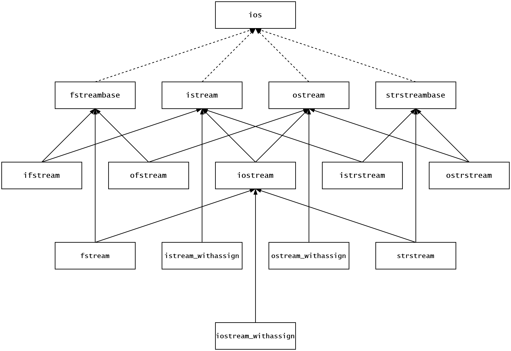

# Day 13

**[补充]** 任何基本类型的数据都能隐式转换为布尔类型, 但是**任何复合类型数据如何转换为布尔类型呢?——利用类型转换操作符函数** <p>
在C++语言中, 经常出现将类对象放在 `bool` 上下文中, 主要有六种情况——
1. 利用类对象给 `bool` 变量做初始化
2. 利用类对象给 `bool` 变量赋值
3. `if` 语句的判定条件
4. `while` 循环的判定条件
5. `for` 循环的判定条件
6. 逻辑反
```
class A { ... };
A a;

// 1. 利用类对象给 bool 变量做初始化
bool b = a;

// 2. 利用类对象给 bool 变量赋值
bool c;
c = a;

// 3. if 语句的判定条件
if (a) { ... }

// 4. while 循环的判定条件
while (a) { ... }

// 5. for 循环的判定条件
for (...; a; ...) { ... }

// 6. 逻辑反
!a;
```
一旦出现上述的六种情况, 编译器需要将类对象转换为 `bool` <p>
C++ 标准库封装的流对象 (例如: cin/cout), 允许我们放置在 `bool` 上下文中, 可以实时判断 I/O操作 (打开操作/读操作/写操作/...) 是否成功 


**I/O 流** <p>
***I/O 流的基本概念***
- 流/流数据(Stream)
    - 字节序列形式的数据(如: 二进制数据、文本字符、图形图像、音频视频等等), 犹如流水一般, 由一个对象流入另一个对象
    - 可以说, 计算机里所有的数据都是流数据
- 输入流(Input Stream)
    - 数据从**表示输入设备(如键盘、磁盘文件等)的对象**流入**内存对象** <p>
    例如 : `cin >> student;`
- 输出流(Output Stream)
    - 数据从**内存对象**流向**表示输入设备(如显示器、打印机、磁盘文件等)的对象** <p>
    例如 : `cout << student;`
- 流缓冲(Stream Buffer)
    - 介于各种 I/O 设备和内存对象之间的内存缓冲区
    - 当从键盘输入时, 数据首先进入键盘缓冲区, 直到按下回车键, 才将键盘缓冲区中的数据灌注到**输入流缓冲区**, 之后再通过流操作符 "`>>`" 进入内存对象
    - 当向显示器输出时, 数据首先通过流操作符 "`<<`", 从内存对象进入输出流缓冲区, 
- 流对象(Stream Object)
    - 表示各种输入输出设备的对象, 如键盘、显示器、打印机、磁盘文件等, 因其皆以流的方式接收或提供数据, 故称之为流对象
    - 流对象向下访问各种物理设备接口(如显示器、键盘...), 向上与应用程序交互, 中间维护流缓冲区
    - 三个预定义的标准流对象
        - `cin` 标准输入设备——键盘
        - `cout` 标准输出设备——显示器
        - `cerr` 标准错误输出设备——显示器, 不带缓冲
- 流类(Stream Class)
    - 用于实例化流对象的类
    - `cin` 和 `cout` 分别是 `istream_withassign` 和 `ostream_withassign` 类的对象
- 流类库(Stream Class Library)
    - C++ 以继承的父哪个是定义了一组流类, 并将其作为标准 C++ 库的一部分提供给用户
    - 基于流类库可以构建三种形式的流对象
        - 面向控制台的 I/O 流
        - 面向文件的 I/O 流
        - 面向内存的 I/O 流

***I/O 流类库***

- `fstreambase` 和文件有关的操作
- `istream` 和输入有关的操作
- `ostream` 和输出有关的操作
- `strstreambase` 和字符串有关的操作
- `ifstream` 继承自 `fstreambase` 和 `istream`, 输入文件流类, 即读文件操作
- `ofstream` 继承自 `fstreambase` 和 `ostream`, 输出文件流类, 即写文件操作
- `iostream` 继承自 `istream` 和 `ostream`, 输入输出流类
- `istrstream` 继承自 `strstreambase` 和 `istream`, 输入字符串类, 即读字符串操作
- `ostrstream` 继承自 `strstreambase` 和 `ostream`, 输出字符串类, 即写字符串操作
- `fstream` 继承自 `fstreambase` 和 `iostream`, 输入输出文件流类
- `strstream` 继承自 `strstreambase` 和 `iostream`, 输入输出字符串类
- `istream_withassign`, 用于定义 `cin` 对象
- `ostream_withassign`, 用于定义 `cout` 对象
- `iostream_withassign`, 用于定义 `cerr` 对象

| 目标 | 抽象 | 输入 | 输出 | 输入输出 |
| :-: | :-: | :-: | :-: | :-: |
| 抽象 | ios | istream | ostream | iostream |
| 控制台 | - | *istream_withassign* | *ostream_withassign* | *iostream_withassign* |
| 文件 | fstreambase | **ifstream** | **ofstream** | **fstream** |
| 内存 | strstreambase | **istrstream** | **ostrstream** | **strstream** |
- 以上只有 *斜体* 和 **加粗体** 的 9个类, 针对具体目标执行具体操作
- 其中 *斜体* 的 3个类已经预定义了 `cin/cout/cerr` 流对象
- 实际编程中主要使用 **加粗体** 的 6个类实现针对文件和内存的 I/O
- 出于某些原因, 所有的 I/O流类都不支持拷贝构造和拷贝赋值
- 头文件及其对应使用
    - **`#include <iostream>`**
        - `ios`、`istream`、`ostream`、`iostream`
        - `istream_withassign`、`ostream_withassign`、`iostream_withassign`
    - **`#include <fstream>`**
        - `ifstream`、`ofstream`、`fstream`
    - **`#include <strstream>`**
        - `istrstream`、`ostrstream`、`strstream`
    - **`#include <strstream>`**
        - `istringstream`、`ostringstream`、`stringstream`

***I/O 流的打开与关闭***
- 通过构造函数打开 I/O流
    - 打开输入流 <p>
        `ifstream(const char* filename, openmode mode);`
    - 打开输出流 <p>
        `ofstream(const char* filename, openmode mode);`
    - 打开输入输出流 <p>
        `fstream(const char* filename, openmode mode);`
- 其中 `filename` 表示文件路径, `mode` 表示打开模式 
- 打开模式 `mode`
    - `ios::out`
        - 打开文件用于**写入**, 不存在即创建, 存在则清空
        - 适用于 `ofstream` (缺省) / `fstream`
    - `ios::app`
        - 打开文件用于**追加**, 不存在即创建, 存在不清空
        - 适用于 `ofstream` / `fstream`
    - `ios::trunc`
        - 打开时清空原内容
        - 适用于 `ofstream` / `fstream`
    - `ios::in`
        - 打开文件用于**读取**, 不存在则失败, 存在不清空
        - 适用于 `ifstream` (缺省) / `fstream`
    - `ios::ate`
        - 打开时**定位文件尾**
        - 适用于 `ifstream` / `fstream`
    - `ios::binary`
        - 以二进制模式读写
        - 适用于 `ifstream` / `fstream`

***I/O 流对象的状态***
- I/O 流类对象内部保存当前状态, 其值为以下常量的位或
    - `ios::goodbit` **0, 一切正常**
    - `ios::badbit` **1, 发生致命错误**
    - `ios::eofbit` **2, 遇到文件尾**
    - `ios::failbit` **4, 打开文件失败或实际读写字节数未达预期**
        ```
        // 简单模拟 C++ 标准库对 ifstream类的内部实现, 与实际实现不同
        class ifstream {
        public:
            ifstream(const char* path, ...){
                m_f = open(path, ...);
                if(m_f == -1){
                    m_state = ios::failbit;
                } else {
                    m_state = ios::goodbit;
                }
            }

            operator bool() const {
                return m_state == 0;
            }
            // 理论上 ifstream 类中存在着大量的 operator>> 函数
            // 形参都不同, 互相之间存在重载关系
            // typename 可以代表 int/double/string/...
            ifstream& operator>>(typename data){ 
                int ret = read(m_f, ...);
                if(ret == -1){
                    m_state = ios::failbit;
                } else {
                    m_state = ios::goodbit;
                }
                ...; // 其他用于读取文件部分的代码
            }
        private:
            int m_f;    // 保存文件描述符
            int m_state;// 保存状态值
        };
        ```
- I/O 流的状态成员函数
    | 状态成员函数 | 说明 |
    | :-: | :-: |
    | `bool ios::good(void);` | 流可用, 状态位全零, 返回 true |
    | `bool ios::bad(void);` | badbit位是否被设置 |
    | `bool ios::eof(void);` | eofbit位是否被设置 |
    | `bool ios::fail(void);` | failbit位是否被设置 |
    | `iostable ios::rdstate(void)` | 获取当前状态 |
    | `void ios::clear(iostate s = ios::goodbit);` | 设置(复位)流状态 |
- 一个处于 `1` 和 `4` 状态的流, 在复位前无法工作

**非格式化 I/O**
- 写入字符
    - `ostream& ostream::put(char ch);`
        - 一次向输入流行写入一个字符, 返回流本身
- 刷输出流
    - `ostream& ostream::flush(void);`
        - 将输出流缓冲区中的数据刷到设备上, 返回流本身
- 读取字符
    - `int istream::get(void);`
        - 成功返回得到的字符, 失败或遇到文件尾返回 EOF
    - `istream& istream::get(char& ch);`
        - 返回输入流本身, 其在布尔上下文中的值, 成功为 `true`, 失败或遇到文件尾为 `false`
- 读取行 
    - `istream& istream::getline(char* buffer, streamsize num, char delim = '\n');`
        - 读取字符(至界定符 `delim`, 缺省为 `\n` )到 `buffer` 中
        - 一旦读取了 `num` 个字符还未读取界定符, 第 `num` 个字符设置为 `\0` , 返回( **输入流对象状态为 4** )
        - 如果因为遇到界定符( 缺省为 `\n` ), 返回( **输入流状态为 0** ), 定界符被读取并丢弃, 追加结尾空字符 `\0` , 读指针停在该定界符的下一个位置
        - 遇到文件尾, 返回( **输入流对象状态为 6** )

**二进制 I/O**
- 读取二进制数据
    - `istream& istream::read(char* buffer, streamsize num)`
        - 从输入流中读取 `num` 个字节到缓冲区 `buffer` 中
        - 返回流对象本身, 其在布尔上下文中的值, 成功(读满)为 `true`, 失败(没读满)为`false`
        - 如果没读满 `num` 个字节, 函数就返回了, 比如遇到了文件尾, 最后一次读到缓冲区 `buffer` 中的字节数, 可以通过 `istream::gcount()` 函数获得
    - 获取读长度
        - `streamsize istream::gcount(void)`
            - 返回最后一次输出流中读取的字节数
- 写入二进制数据
    - `ostream& ostream::write(const char* bufer, streamsize num)`
        - 将缓冲区 `buffer` 中的 `num` 个字节写入到输出流中
        - 返回流本身, 其在布尔上写文中的值, 成功(写满)为 `true`, 失败(没写满)为 `false`

**读写指针与随机访问**
- 设置读(seekg)/写(seekp)指针位置
    - `istream& istream::seekg(off_type offset, ios::seekdir origin)`
    - `ostream& ostream::seekp(off_type offset, ios::seekdir origin)`
        - `origin` 表示 **偏移量 `offset` 的起点** <p>
          `ios::begin` 从文件的第一个字节 <p>
          `ios::cur` 从文件的当前位置 <p>
          `ios::end` 从文件的最后一个字节的下一个位置 <p>
        - `offset` 为 **负/正** 表示向文件 **头/尾** 的方向偏移
        - 读写指针被移动到文件头之前或者文件尾之后, 则失败
- 获取读(tellg)/写(tellp)指针位置
    - `pos_type istream::tellg(void);`
    - `pos_type ostream::tellp(void);`
        - 返回读/写指针当前位置相对于文件头的字节偏移量

**字符串流**
- 输出字符串流
    ```
    #include <sstream>
    ostringstream oss;
    oss << 1234 << ' ' << 56.78 << ' ' << "ABCD";
    string os = oss.str();
    ```
- 输入字符串流
    ```
    #include <sstream>
    string is("1234 56.78 ABCD");
    istringstream iss (is);
    int i;
    double d;
    string s;
    iss >> i >> d >> s;
    ```

**格式化 I/O**
- 流函数(一组成员函数)
    - I/O流类(ios)定义了一组用于控制输入输出格式的公有成员函数, 调用这些函数可以改变 I/O流对象内部的格式状态, 进而影响后续输入输出的格式化方式
- 流控制符(一组全局函数)
    - 标准库提供了一组特殊的全局函数, 它们有的带有参数( 在 `#include <iomanip>` 头文件中声明 ) , 有的不带参数( 在 `#include <iostream>` 头文件中声明)
    - 因其可以直接被嵌入到输入输出表达式中, 影响后续输入输出格式, 故被形象的称之为**流控制符**
- ***I/O 格式化函数***

| 格式化函数 | 说明 |
| :-: | :-: |
| `int ios::precision(int);` | 设置浮点精度, 返回原精度 |
| `int ios::precision(void) const;` | 获取浮点精度 |
| `int ios::width(int);` | 设置显示域宽, 返回原域宽 |
| `int ios::width(void) const;` | 获取显示域宽 |
| `char ios::fall(char);` | 设置填充字符, 返回原字符 |
| `char ios::fall(void) const;` | 获取填充字符 |
| `long ios::flags(long);` | 设置格式标志, 返回原标志 |
| `long ios::flags(void) const;` | 获取格式标志 |
| `long ios::setf(long);` | 添加格式标志位,返回原位置 |
| `long ios::setf(long, long);` | 添加格式标志位, 返回原标志, 先用第二个参数将互斥域清零 |
| `long ios::unsetf(long);` | 清除格式标志位, 返回原标志 |
- 一般而言, 对 I/O流对格式的改变都是**持久**的, **即只要不再设置新格式, 当前格式将始终保持下去**
- **显示域宽是个例外**, 通过 `ios::width(int)` 设置的域宽, 只影响紧随其后的第一次输出, 再往后的输出又恢复到默认状态

- ***I/O 流格式标志***

| 格式标志位 | 互斥域 | 说明 |
| :-: | :-: | :-: |
| `ios::left` | `ios::adjustfield` | 左对齐 |
| `ios::right` | `ios::adjustfield` | 右对齐 |
| `ios::internal` | `ios::adjustfield` | 数值右对齐, 符号左对齐 |
| `ios::dec` | `ios::basefield` | 十进制 |
| `ios::oct` | `ios::basefield` | 八进制 |
| `ios::hex` | `ios::basefield` | 十六进制 |
| `ios::fixed` | `ios::floatfield` | 用定点小鼠表示浮点数 |
| `ios::scientific` | `ios::floatfield` | 用科学计数法表示浮点数 |
| `ios::showpos` | - | 正整数前面显示 **+** 号 |
| `ios::showbase` | - | 显示进制前缀 **0** 或 **0x** |
| `ios::showpoint` | - | 显示小数点和尾数 **0** |
| `ios::uppercase` | - | 数中字母显示为大写 |
| `ios::boolalpha` | - | 用字符串表示布尔值 |
| `ios::unitbuf` | - | 每次插入都刷流缓冲 |
| `ios::skipws` | - | 以空白字符作分隔符 |

- ***I/O 流格式化控制符***

| 格式化控制符 | 说明 | 输入 | 输出 |
| :-: | :-: | :-: | :-: |
| `left` | 左对齐 | NO | YES |
| `right` | 右对齐 | NO | YES |
| `internal` | 数值右对齐, 符号左对齐 | NO | YES |
| `dec` | 十进制 | YES | YES |
| `oct` | 八进制 | YES | YES |
| `hex` | 十六进制 | YES | YES |
| `fixed` | 用定点小数表示浮点数 | NO | YES |
| `scientific` | 用科学计数法表示浮点数 | NO | YES |
| `ends` | 空字符 | NO | YES |
| `endl` | 换行符, 刷流缓冲 | NO | YES |
| `flush` | 刷流缓冲 | NO | YES |
| `setprecision(int)` | 设置浮点精度 | NO | YES |
| `setw(int)` | 设置显示域宽 | NO | YES |
| `setfill(int)` | 设置填充字符 | NO | YES |
| `setiosflag(long)` | 设置格式标志 | YES | YES |
| `resetiosflags(long)` | 消除格式标志 | YES | YES |


